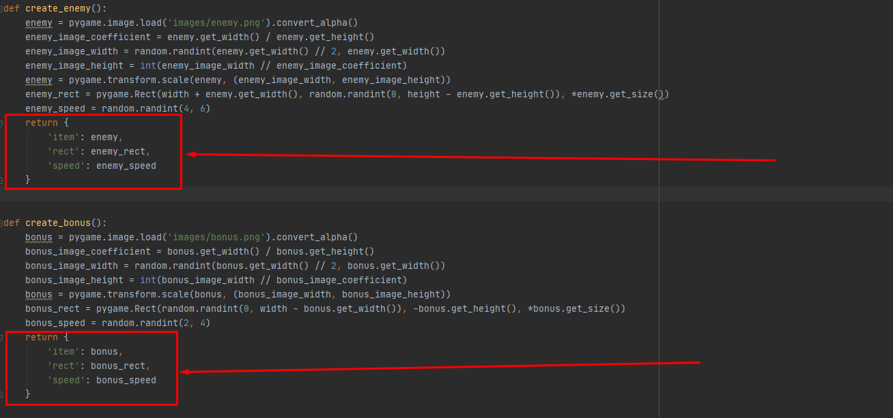
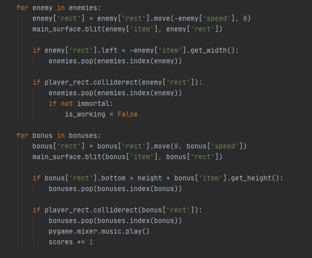

### Від функцій до Об'єктів
---

#### Списки. Індекси. Що таке enemy[2] ???

Поки що ми використовували такий процес:  
Ми створювали ворогів через функцію  `create_enemy()`, яка повертала нам список з трьома змінними:   
`enemy` - картинкою ворога (об'єкт типу Surface),   
`enemy_rect` - площина, де розташовується картинка (об'єкт типу Rect) та   `enemy_speed` - швидкість ворога (просто число). Ці дані - ті "властивості" ворога, акі дозволяють нам його відмалювати, рухати по екрану та перевіряти на зіткнення з гравцем.   
Саме цей список ми додавали до списку ворогів - `enemies` де він зберігався вкладений список.
На приклад, список `enemies` із двома ворогами :

```
[
  [<Surface(100x30x32 SW)>, <rect(160, 532, 100, 30)>, 5], 
  [<Surface(100x30x32 SW)>, <rect(660, 99, 100, 30)>, 4]
]
```

Це було ОК і нормально працювало. Принаймні ми знали, що перший елемент, з індексом `0` - картинка ворога, другий, `1` - ... не пам'ятаю, а третій, `2` - ... швидкість?

```
    for enemy in enemies.copy():
        enemy[1]  = enemy[1].move(-enemy[2], 0)
        main_surface.blit(enemy[0], enemy[1])
```        

Код робочий, але не дуже читабельний.

#### Покращення № 1. Словники.

Якщо замість списку у функції `create_enemy()` повертати словник, код читається набагато легше.   
По-перше, зрозуміліше, що вертає функція:  

  

По-друге, у частині обробки стану ворогів більш зрозуміло, що відбувається:  

  

При цьому список `enemies` містить ті ж самі дані, але по ключам словника тепер зрозуміліше, що перед нами:

```
[
  {'item': <Surface(100x30x32 SW)>, 'rect': <rect(90, 278, 100, 30)>, 'speed': 5}, 
  {'item': <Surface(100x30x32 SW)>, 'rect': <rect(687, 128, 100, 30)>, 'speed': 3}
]
```

Погодьтеся, `enemy['rect']  = enemy['rect'].move(-enemy['speed'], 0)` більш інформативно за `enemy[1]  = enemy[1].move(-enemy[2], 0)`  
Окрім того, якщо ми вирішимо додати додаткові "властивості" (хітпоїнти, силу вибуху і т.п. ) це не змінить складність сприйняття і використання цих об'єктів на відміну від індексів `[0,1,2,3,4 ... ]`.  

#### Покращення № 2. Об'єкти.

До цього моменту я уникав цього слова. Але що таке наші "вороги"?   
Об'єкти.  
Так, по суті ми вже маємо об'єкти та вони мають певні властивості.  
То чого б не називати речі своїми іменами? :)  
Об'єкти значно складніші за базові типи даних, але дуже потужні.  
Не будемо зараз занурюватися у опис ООП, по-перше: це досить об'ємна тема, а по-друге: це все є описано набагато краще, ніж я можу пояснити.  
Отож, у нас є гра і ми хочемо мати об'єкт.  
І як буде виглядати об'єкт для того ж ворога?  
Для створення об'єкту - тої сутності, сукупності властивостей (Звучить серйозно, але по суті це - набір об'єднаних змінних),  
якою ми можемо маніпулювати у грі (відображати, пересувати, прибирати)   
нам потрібен "шаблон", за яким буде створено потрібний нам об'єкт.
У пітоні такий шаблон має назву "клас" - `Class`.
Ми описуємо клас "Ворог" `class Enemy()`, так, ім'я класу прийнято писати з великої букви, а потім створюємо об'єкт даного класу: `enemy = Enemy()`, та додаємо до списку `enemies`: `enemies.append(enemy)`  

Зауважу, що у `pygame` для цього є спеціальний механізм:  
створюємо групу:  
  `enemies = pygame.sprite.Group()`  
та додаємо елемент:  
  `enemies.add(enemy)`  
Це дає купу додаткових можливостей, але для спрощення далі разглядається варіант зі звичайним списком `enemies`.  

Отже, створимо клас `Enemy`:  
`class Enemy(pygame.sprite.Sprite):` - у дужках ми вказуємо від якого класу буде походити наш клас.   
Біліотека `pygame` має клас `pygame.sprite.Sprite` - якраз для спрайтових об'єктів.   
Далі нам треба визначити властивості нашого класу.   
Для цього робиться спеціальна функція (її ще називають "конструтктор класу") `__init__`, яка власне ініціює об'єкт, який буде створений на базі нашого класу. Так ми задамо аргументи, які буде потрібно вказати при створені нашого "ворогу". Нехай зараз це будуть  `x` та `y` - координати де має з'явитися об'єкт.
Ще одна важлива деталь - для будь-якої функції, яка належить класу (їх ще називають "методи класу") перший параметр називається `self` і він присутній завжди. Навіть якщо функція не має арументів, все одно хоча б `self` має бути прописаний:

>  def draw(self):   
>       main_screen.blit(self.image, self.rect)   

Далі додатково викликається метод `__init__` батьківського класу:  
`pygame.sprite.Sprite.__init__(self)`  
та йдуть вже звичні по функції `create_enemy()` кроки:  
завантажується картинка,     
підганяється під розміри  -  ` pygame.transform.scale(image, enemy_size)`  
(тут `enemy_size` - це кортеж, заданий на початку гри: `enemy_size = (100, 30)`)  
  

задається швидкість               `self.speed = randint(4,6)`  
визначається площина, де буде малюватися картинка  `self.rect = self.image.get_rect()`    
та задається координати центру вищезгаданої площини.   
Ось тут і використовуються ті `x` та `y`, яких ви вказали у параметрах функції.  

```
class Enemy(pygame.sprite.Sprite):
    def __init__(self, x, y):
        pygame.sprite.Sprite.__init__(self)
        image = pygame.image.load('img/enemy.png').convert_alpha()
        self.image = pygame.transform.scale(image, enemy_size)
        self.speed = randint(4,6)
        self.rect = self.image.get_rect()
        self.rect.center = (x,y)
```

Тут є важливий момент. Якщо ми у функції створимо змінну, вона існуватиме лише протягом роботи цієї функції. Як змінна `image`.   
Якщо ж нам потрібно, щоб змінна належала нашому об'єкту, її треба задати з префіксом `self.` - як `self.image`. Її вже можна буде використати як властивість об'єкту: `enemy.speed`  
Так, зовні ми звертаємося через змінну-вказівних на об'єкт (пам'ятаєте: `enemy = Enemy()`?) та через крапку - ім'я змінної або функції цтого об'єкту: `enemy.speed` або `enemy.move(x,y)` (звісно, якщо `move()` в нього є)  

Тепер, коли ми маємо клас `Enemy`, змінимо код створення ворогів у грі.  
Ми вже не генеруємо координати появи об'єкта, а очікуєто. що їх нам нададуть при створенні (`def __init__(self, x, y):`):


```
        if event.type == CREATE_ENEMY:
            # enemies.append(create_enemy()) # - так ми робили раніше
            enemy = Enemy(width+enemy_size[0], randint(0, height-enemy_size[1]))
            enemies.append(enemy)
```

Все, у нас тепер вороги - об'єкти.  
Завдяки цьому мі можемо гнучко додаввати їм властивості (більше, ще більше `self.`-змінних!) та власні методи, яки будуть визначати їх поведінку.

Але це - тема іншої статті.
